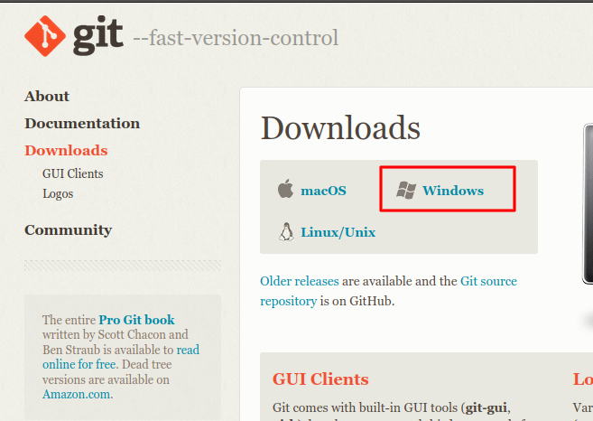
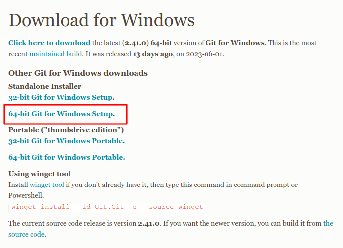
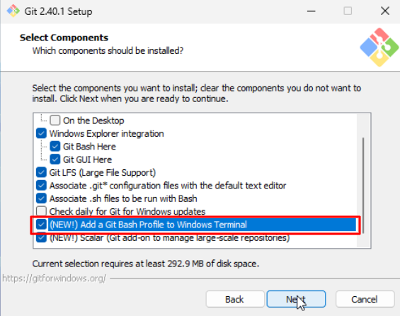
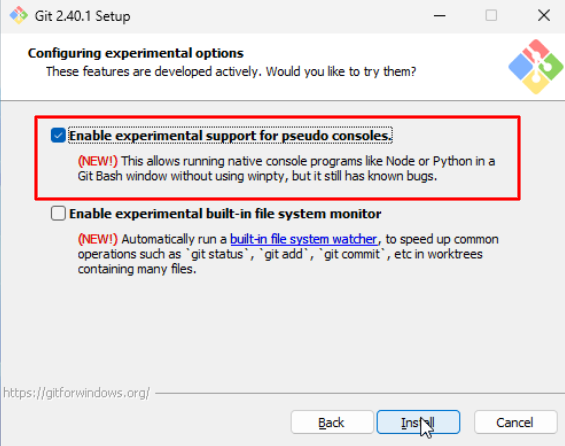
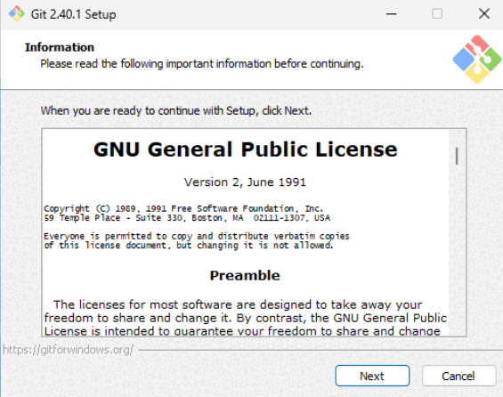
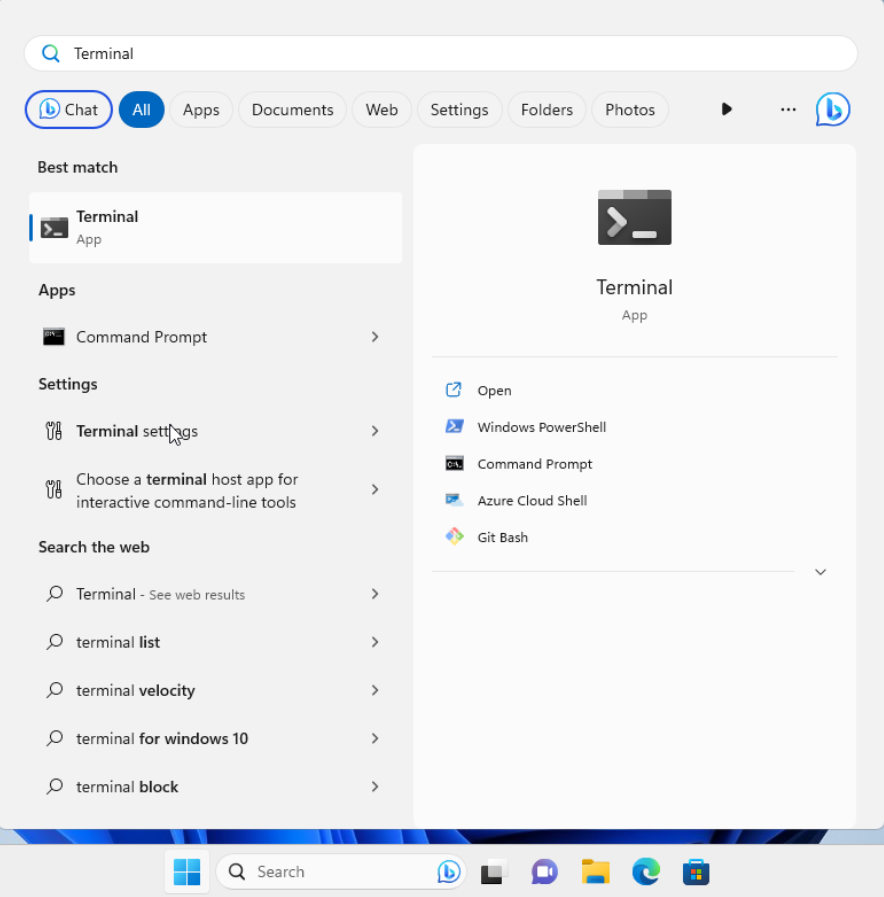
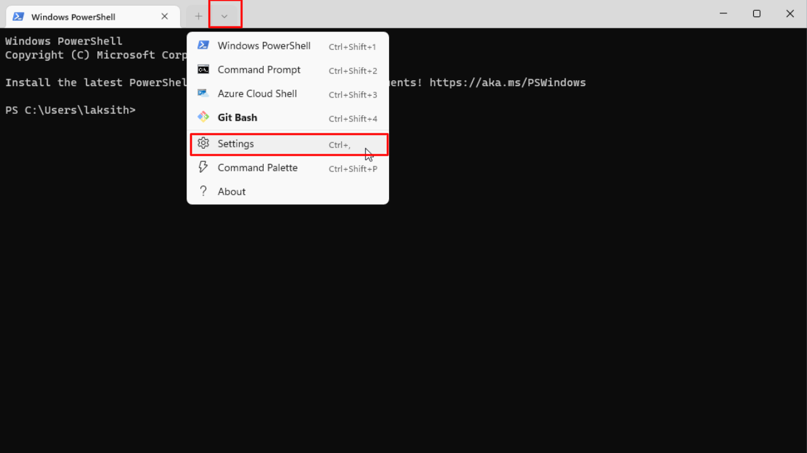
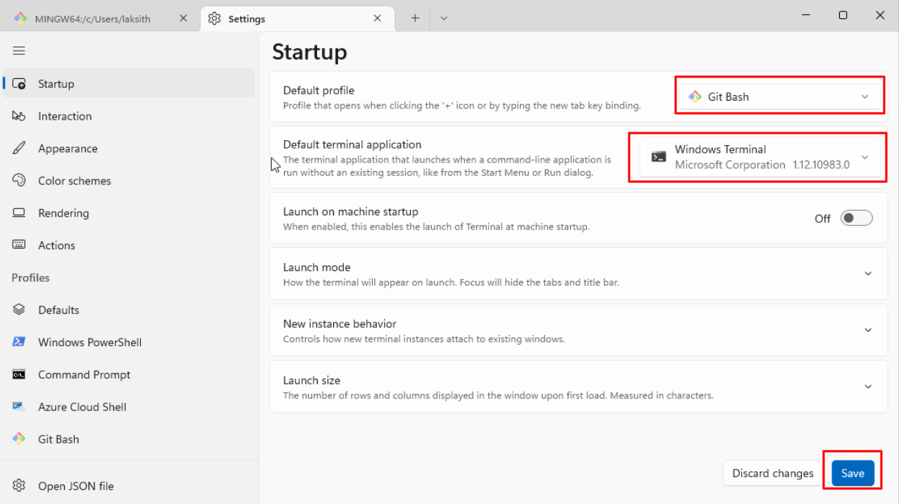
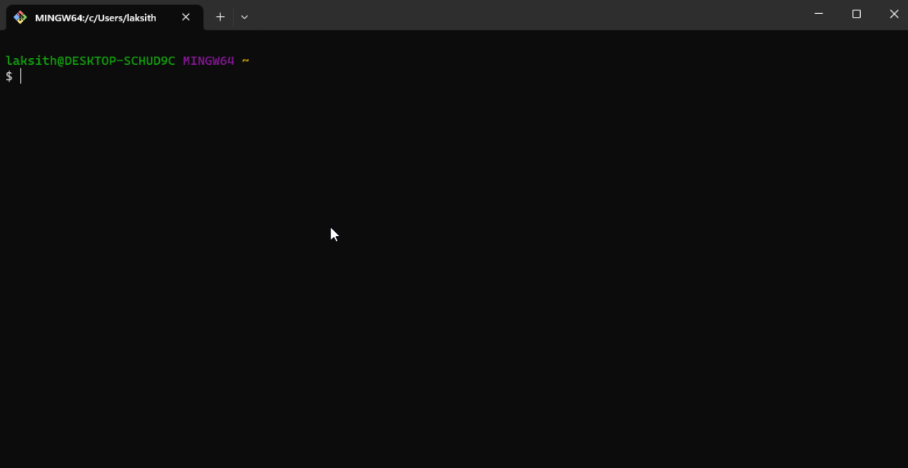

## A. Install Git

1.  Install git. Head to
    [http://git-scm.com/download/](http://git-scm.com/download/)
    and download the Git for Windows installer.

    

    

2.  Run the installer. You'll be faced with many options. We'll only be selecting different options on:

    - The **Select Components** page, where we add a Git bash profile to the windows terminal.

      

    - The **Configuring Experimental Options** page, where we add support for native console programs.

      

3. All the other options should be left as is. The entire install process is shown in the gif below:

   

## B. Install Windows Terminal

All recent versions of Windows 10 and 11 come with the Terminal app pre-installed. If you can find the app by searching 
for terminal in the start menu, you should be good to go for this section and can skip onto the next step: 

**Note: We're looking for the terminal app selected in the screenshot and not the command prompt.**

If not, we recommend that you install the terminal app from the [Microsoft Store](https://aka.ms/terminal), which does not 
require a login or payment. Alternate installation instructions are [here](https://github.com/microsoft/terminal). 

## C. Configure Windows Terminal

When you start up windows terminal, you'll see a powershell terminal prompt. We don't want to use "PowerShell", which is based on Windows.
Instead, we want to use a "bash shell" (specifically, Git bash), which is based on Linux.
To set this up:

1.  Click on the drop-down arrow next to the plus "+" sign at the top and open the settings page.

    

2. Set the default profile to Git bash, default terminal application to windows terminal and hit save.

    

3. If you completed the previous steps correctly,
    when you click on the plus sign, you should see a Git Bash shell window open.

    

    At this point, you're all done!
    You can now move on with the rest of Lab 1.

## D. Note on WSL2 (experimental)

The Summer 2020 update of Windows contains a Linux kernel called WSL2.
We will not be officially supporting WSL2 for this term.
If you're pretty computer savvy, you're welcome to try it out though!
One word of warning: You will need to install javac, java, and git inside WSL2 again,
following the [Linux](linux) instructions for your chosen distribution.
