## [FAQ](faq)

Each assignment will have an FAQ linked at the top. You can also access it by
adding "/faq" to the end of the URL. The FAQ for Lab 16 is located
[here](faq).

{: .warning}
> **Warning:** this assignment is not officially released yet. This spec is subject to change until this warning disappears.

## Before You Begin

As usual, pull the files from the skeleton.

## Introduction

We have already seen a few implementations of the Set ADT, and in this lab
we will see a slightly different approach to this ADT. Today we will learn
about *disjoint sets*, which we can use next week to implement
some minimum spanning tree algorithms.

## Disjoint Sets

Suppose we have a collection of companies that have gone under mergers or
acquisitions. We want to develop a data structure that allows us to determine if
any two companies are in the same conglomerate (group). For example, if company X and
company Y were originally independent, but then Y acquired X, we want to be able to
represent this new connection in our data structure. How would we do this? One
way we can do this is by using the disjoint sets data structure.

The **disjoint sets data structure** represents a *collection of sets that are disjoint*, meaning that any item in this data structure is found in no more than
one set. When discussing this data structure, we often limit ourselves to two
operations, `union` and `find`, which is also why this data structure is
sometimes called the **union-find data structure**. We will be using the two names
interchangeably for the remainder of this lab.

The `union` operation will combine two sets into one set. The `find` operation
will take in an item, and tell us which set that item belongs to. With this
data structure, we will be able to keep track of the acquisitions and mergers
that occur!

Let's run through an example of how we can represent our problem using disjoint
sets with the following companies:

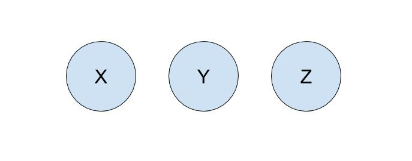

To start off, each company is in its *own set* with *only itself*. A call to
`find(X)` will return $$X$$ (and similarly for all the other companies). If
$$Y$$ acquired $$X$$, we will make a call to `union(X, Y)` (or `union(Y, X)`; order won't matter for our final implementation) to represent that
the two companies should now be linked. As a result, a call to `find(X)` will
now return $$Y$$ (assuming $$Y$$ acquired $$X$$ as mentioned above), showing that $$X$$ is now in the set represented by $$Y$$. The `union`ed
result is shown below.

{: .info}
>For the rest of the lab, we will work with non-negative integers as the items in
our disjoint sets. If you wanted to have a disjoint set of something that
did not correspond to a set of integers, you could generalize this data
structure by maintaining some sort of mapping between whatever the objects
are and the set of integers contained within the disjoint set data structure.

{: .info}
>In this lab, we will talk about four different implementations for disjoint sets, namely **Quick Find**, **Quick Union**, **Weighted Quick Union**, and **Weighted Quick Union with Path Compression**. You will be implementing the last one in `UnionFind.java`, and that will be your deliverable for this lab. To read about each of these implementations, press "**Click to expand:**".

### **Quick Find**

  

**Click to expand:**
  

Lets begin our first attempt to implement the union-find structure: we'll call this one the **quick find**. In order to implement disjoint sets, we need know to which set each item belongs to. Quick find's backing data structure is an array that details just that.

{: .info}
>For **quick find**:
>- In our array, *the index will represent the item* (hence using non-negative integers as our items)
and *the value at that index will represent which set that item belongs to*.

The way we will represent our sets is with an "representative element". In our analogy with the conglomerates, this might be the company that is acquiring all the other companies; you can think of it as the parent company. Based on this implementation, if the $$N^{\text{th}}$$ item in our array is in a set *represented* by the $$M^{\text{th}}$$ item, then the value at index $$N$$ will be $$M$$.

For example, if our set looked like this,

then we could represent the connections like this:

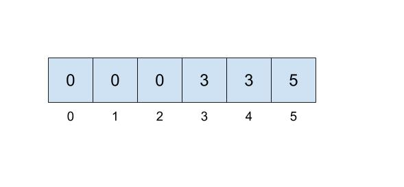

Here, we will be choosing the smallest number of the set to represent the face
of the set, which is why the set numbers are 0, 3, and 5. By looking at the second image, which shows the underlying array, we can see that indices 0, 1, and 2 all have a value of 0. This directly corresponds to saying items 0, 1, and 2 are all in the same set, which has a representative element 0!

This approach uses the *quick-find* algorithm, **prioritizing the runtime of the `find` operation but making the `union` operations slow**. How slow is the `find` operation in the worst case, and how slow is the `union` operation in the worst case?

  

**Click to reveal answers:**

1. Worst-case runtime for quick-find data structure's <code>find</code> with N items: $$\Theta(1)$$. We can directly index into the array to look up what value an index corresponds to. 
2. Worst-case runtime for quick-find data structure's <code>union</code> with N items: $$\Theta(N)$$. We need to loop through all array elements to update the necessary values. As an example, consider unioning $$N-1$$ elements with the remaining $$1$$ element.

### **Quick Union**

  

**Click to expand:**
  

Quick find prioritized making the `find` operation fast, but supposed we prioritize making the `union` operation fast instead. **Quick union** does this by representing each set as a *tree*, as opposed to what we did above.

This tree will have the following qualities:

- The nodes will be the items in our set
- Each node only needs a reference to its *parent*, rather than a direct reference
  to the *face* of the set
- The top of each tree (i.e. the **root**) will be
  the face of the set it represents.

Now, if we were to union two sets represented by items $$X$$ and $$Y$$, we wouldn't have to scan the whole array to change the parent of *every single item* in $$X$$'s set to be $$Y$$. Instead, we could just change $$X$$'s parent to $$Y$$, and be done!

In the example from the beginning of lab, $$Y$$ would be the face of the set
represented by $$X$$ and $$Y$$, so $$Y$$ would be the root of the tree
containing $$X$$ and $$Y$$:

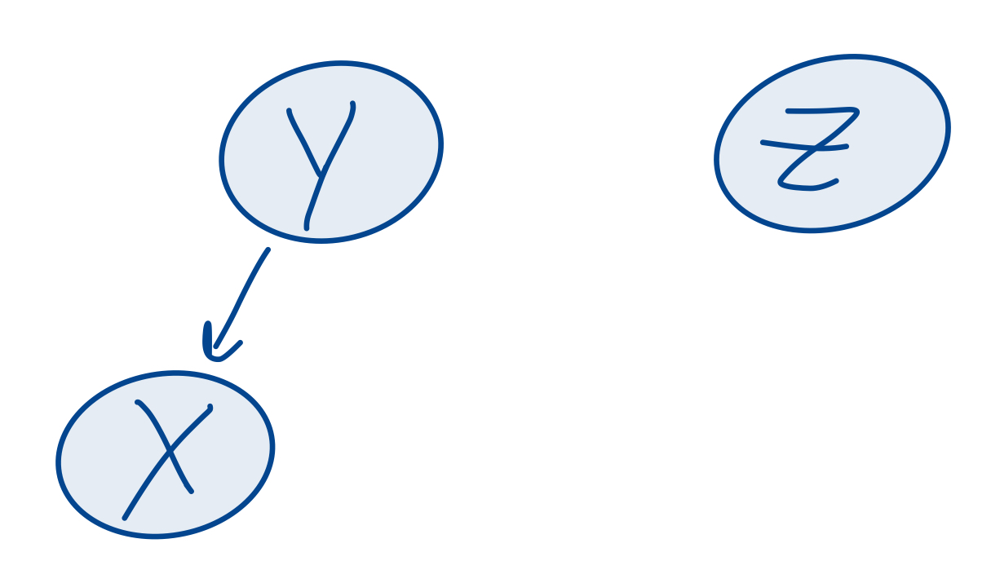
<!--  -->

How do we modify our data structure from quick find to make this quick union? **We will just need to replace the set references with parent references!**

{: .info}
>For **quick union**:
>- The indices of
the array will still correspond to the item itself, but we will put the *parent*
references inside the array instead of direct *set* references.
>- If an item does
not have a parent, that means this item is the face of the set (i.e. the root of the tree) and we will instead put the value $$-x$$ inside the array, where $$x$$ is the **size** of the tree (total number of nodes). We make this value negative to distinguish the size from parent references. Now, if the value at a given index is less than 0, we know that the index corresponds to the *root* of a set. If the value is greater than 0, then that value is the parent of the current item!

When we `union(u, v)`, we will **find the set that each of the values `u` and `v` belong to (the roots of their respective trees), and make one the child of the other (depending on tie-breaking scheme)**. If `u` and `v` are both the face of their respective sets (i.e. the roots of their own tree), `union(u, v)` is a fast $$\Theta(1)$$ operation because we just need to make the root of one set connect to the root of the other set!

Let's go
through an example of this quick union data structure. The array
representation of the data structure is shown first, followed by the abstract
tree representation of the data structure.

1. Initially, each item is in its own set, so we will initialize all of the
elements in the array to `-1`.

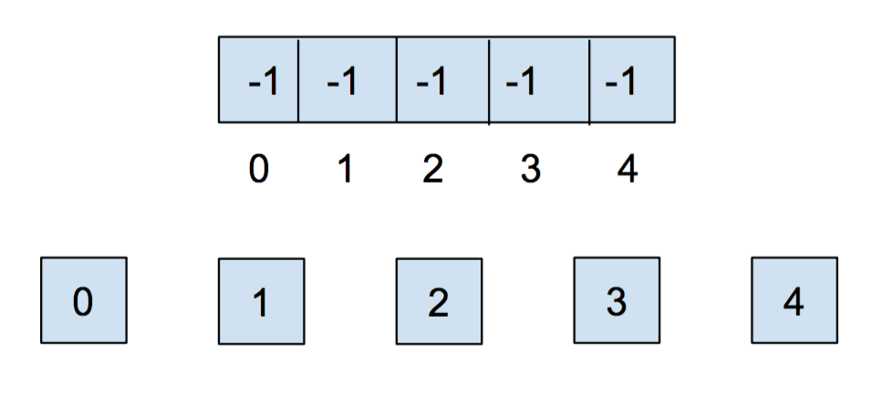

2. After we call `union(0,1)` and `union(2,3)`, our array and our abstract
representation look as below:

3. After calling `union(0,2)`, they look like:

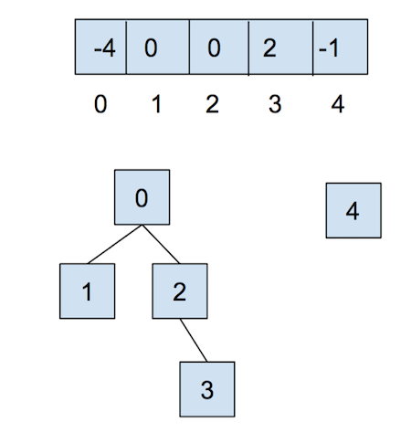

<!-- As an example of how the array is used for quick union, take a look at the image below. 
- The left side shows two disjoint sets (tree representation) and the corresponding array.
- After calling `union(1, 5)`, we find the root of their respective trees (in this case, the nodes `1` and `5` themselves), then arbitrarily set one to be the parent of the other. In this example, we chose to set `5` as `1`'s parent, as indicated in the tree (`1`'s parent is `5`) and in the array (`array[1] = 5`).
- Notice that `5`'s value (array[5]) is $-1$, indicating that it is a root of a tree.

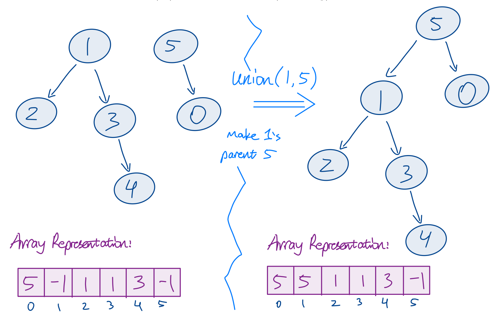 -->

We see that quick union can make the `union` method faster; however, the cost is that **`find` can now be slow**. In order to
find which set an item is in, we must jump through all the parent references and
travel to the root of the tree, which is **$$\Theta(N)$$ in the worst case**. Here's
an example of a tree that would lead to the worst case runtime, which we again
refer to as **spindly**:

In addition, `union`-ing two leaves could lead to the same worst case runtime as
`find`, because we would have to first find the parents of each of the leaves before completing `union` operation. We will now expore some
optimizations to make this runtime faster. 

### **Weighted Quick Union**

  

**Click to expand:**
  

The first optimization that we will do for our quick union data structure is
called "union by size". This will be done in order to keep the trees as shallow
as possible (i.e. have smaller height) and avoid the spindly trees that result in the worst-case runtimes.
When we `union` two trees, we will make the smaller tree (the tree with less
nodes) a subtree of the larger
one, breaking ties arbitrarily. We call this **weighted quick union**.

Because we are now using "union by size", the maximum depth of any item will be
in $$O(\log N)$$, where $$N$$ is the number of items stored in the data
structure. This is a great improvement over the linear time runtime of the
unoptimized quick union. Check the [textbook](https://cs61b-2.gitbook.io/cs61b-textbook/14.-disjoint-sets/14.4-weighted-quick-union-wqu) for a more detailed look on why.

See the following visual for some intuition on how this works:
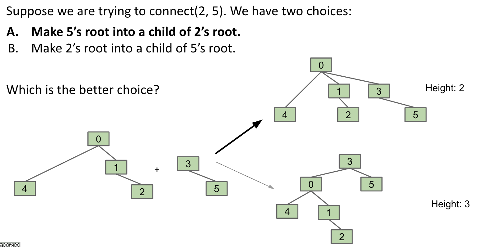

#### **Example**

Let’s go over a example of what this all looks like for weighted quick union. When we initially create our disjoint set, each item is in its own set, so we will initialize all of the elements in the array to $$-1$$. For this representation, we want to track our size in the array, so we **store the weight of a set at its root as the negated weight** (-weight) (to also distinguish between a parent and the weight of the set).

{: .info}
>The tie-breaking scheme in this example is that the smallest element becomes the root - note that this isn’t always the case depending on the implementation.

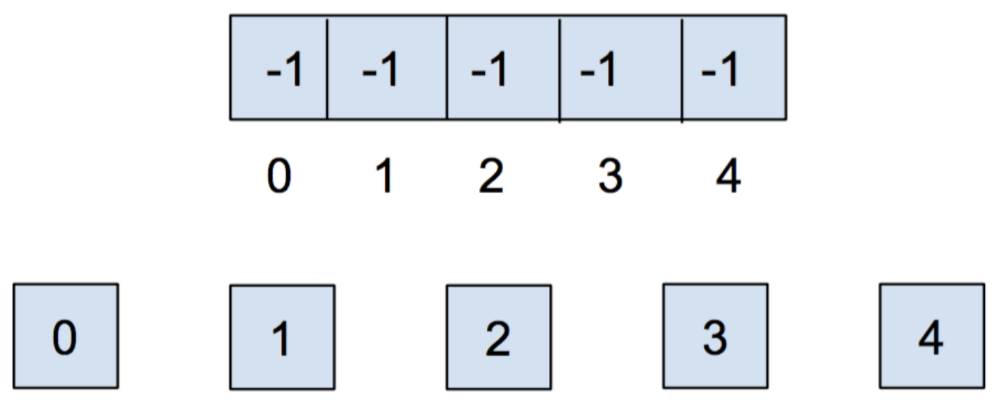

After we call `union(0,1)` and `union(2,3)`, our array and our abstract representation will end up as below:

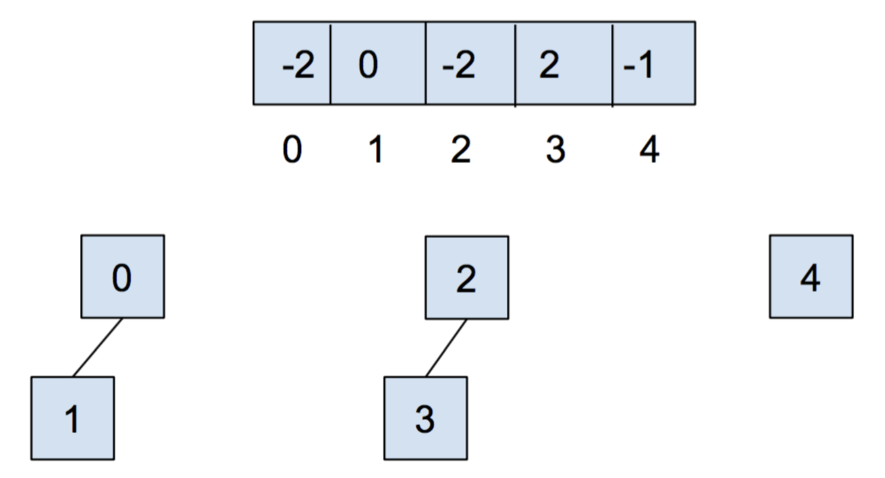

Notice that for above, the values stored at 0 and 2 are $$-2$$, as the roots of the respective set are storing their (negated) size. Now let’s call `union(0,2)`. It’ll look like this:

<!--  -->

For the sake of an example, let’s say we have another disjoint set, in the current state shown below (we are using the same tie-breaking scheme above):

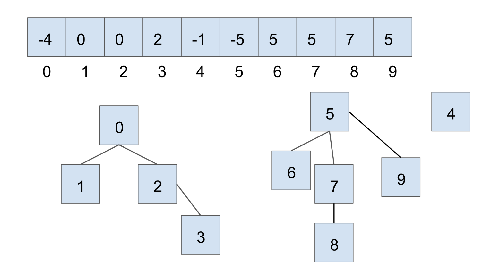

If we were to connect the two larger sets, through `union(7, 2)`, we would get the following:

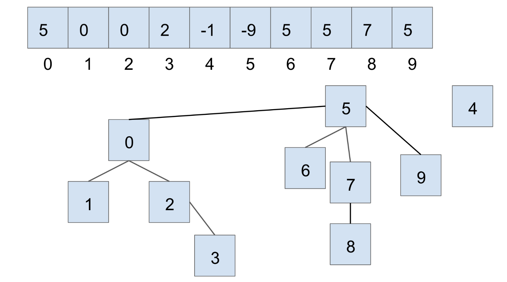

In this case, we connect the roots of the sets that 7 and 2 belong to respectively, with the smaller set’s root becoming the child of the larger set’s root. With weighted quick union, we update two values in the array:
- the smaller root’s parent becomes the root of the larger set
- the larger root’s value is updated accordingly with a new size

### **Weighted Quick Union with Path Compression**

  

**Click to expand:**

Even though we have made a speedup by using a weighted quick union data
structure, there is still yet another optimization that we can do! What would happen if we had a tall tree and called `find` repeatedly on the deepest leaf? With our weighted quick union implementation, each time we would have to traverse the tree from the leaf to the root.

A clever optimization is to move the leaf up the tree so it becomes a *direct child* of the root. That way, the next time you call `find` on that leaf, it will run much more quickly. An even more clever idea is that we could do the same thing to *every* node that is on the path from that leaf to the root, connecting each node to the root as we traverse up the tree. This optimization is called **path compression**. Once you find an item, path compression will make finding it (and all the nodes on the path to the root) in the future faster.

The runtime for any combination of $$f$$ `find` and $$u$$ `union` operations
takes $$\Theta(u + f \alpha(f+u,u))$$ time, where $$\alpha$$ is an *extremely*
slowly-growing function called the [*inverse Ackermann function*](https://en.wikipedia.org/wiki/Ackermann_function#Inverse). And by
"extremely slowly-growing", we mean it grows so slowly that for any practical
input that you will ever use, the inverse Ackermann function will never be
larger than 4. That means for any practical purpose, a weighted quick union data
structure with path compression has `find` operations that take constant time on
average!

- It is important to note that even though this operation can be considered constant time for all practically sized inputs, we should not describe this whole data structure as constant time. We could say something like, it will be constant for all inputs smaller than some incredibly large size. Without that qualification we should still describe it by using the inverse Ackermann function.

An example of this is shown below, where we start out with the following

{: .warning}
>This is only an example to demonstrate what path compression does. Note that you can’t get this structure (the first image, directly below) with a weighted quick union.

After we call on `find(5)`, all of the nodes we traversed to get to the root are updated so that they now connect directly to the root:

{: .info}
>You can visit this link
[here](http://www.cs.usfca.edu/~galles/visualization/DisjointSets.html) to play
around with disjoint sets.

## Exercise: `UnionFind`

We will now implement our own disjoint sets data structure. When you open up
`UnionFind.java`, you’ll see that some skeleton code has been provided for you - you’ll have to fill in the implementation for the following methods:

- `UnionFind(int N)`: This is the constructor. It creates a `UnionFind` data structure that holds N items.
- `int sizeOf(int v)`: Returns the size of the set that `v` belongs to.
- `int parent(int v)`: Returns the parent of `v`.
- `boolean connected(int v1, int v2)`: Returns `true` if the two vertices are connected. Consider using the `find` method.
- `int find(int v)`: Returns the root of the set that `v` belongs to.
- `void union(int v1, int v2)`: Connects `v1` and `v2` together.

Read the documentation to get an understanding of what methods need to be filled
out. Remember to implement both optimizations discussed above, so a **weighted quick union with path compression**, and take note of
the **tie-breaking scheme** that is described in the comments of some of the
methods. This scheme is done for autograding purposes and is chosen arbitrarily.
In addition, remember to ensure that the inputs to your functions are within bounds, and should otherwise throw an `IllegalArgumentException`.

{: .info}
>We recommend that you start with implementing the constructor and taking a look at `find` before the rest of the other methods.

{: .warning}
>Things to note for this lab:
>- We will work with **non-negative integers** as the items in our disjoint sets.
>- You’ll want to implement the following tie-breaking scheme: if the sizes of the sets are equal, tie break by connecting `v1`'s root to `v2`'s root.
>- You should also correctly handle faulty inputs; e.g if invalid vertices are passed into the functions, throw an `IllegalArgumentException`.

{: .task}
>Complete the methods in `UnionFind.java`. **You’ll want to use `find` in `union`.**

## Testing
For this lab, we have provided all the tests locally in `UnionFindTest.java` (yay!) to help you debug.

## Discussion: `UnionFind`

Our `UnionFind` uses only non-negative values as the items in our set.

How can we use the data structure that we created above to keep track of
different values, such as all integers or companies undergoing mergers and
acquisitions? Discuss with a partner.

## Recap

The ultimate goal of this lab was to develop a data type that support the
following operations on $$N$$ objects:
 - `union(int p, int q)` (sometimes called `connect`)
 - `connected(int p, int q)` (sometimes called `isConnected`)

We do not care about finding the actual *path* between `p` and `q`; we care
only about their *connectedness*. A third operation we can support is very
closely related to `connected`:

 - `find(int p)`: The `find` method is defined so that `find(p) == find(q)` if
   and only if `connected(p, q)`. We did not use this in class.

{: .info}
Below are summaries of the four implementations of disjoint sets we covered in this lab. Click on each line to expand the corresponding summary.

  

**Quick Find**
  

This is the most natural solution, where each object is given an explicit
number. Uses an array `id` of length $$N$$, **where `id[i]` is the set number of object `i`** (which is returned by `find(i)`). To connect two objects `p` and
`q`, we change the value of every object in `p`'s bucket to be `q`'s number (or vice versa).

 - `union`: May require many changes to `id`. Takes $$\Theta(N)$$ time, as
   the algorithm must iterate over the entire array.
 - `connected` (and `find`): Takes $$\Theta(1)$$ time.
 

  

**Quick Union**
  

An alternate approach is to change the meaning of our `id` array. In this
strategy, each set is represented as a tree, **where `id[i]` is the parent of object `i`**. The `find` method climbs the ladder of parents until it reaches the root (an object whose value in the array is -1). To union `p` and `q`, we set the root of `p` to point to the root of `q`.

 - `union`: Requires only one change to `id`, but also requires finding the root (worst case $$\Theta(N)$$ time).
 - `connected` (and `find`): Requires finding the root (worst case $$\Theta(N)$$ time).

  

**Weighted Quick Union**
  

Rather than `union(p, q)` making the root of `p` point to the root of `q`,
we instead make the root of the *smaller tree* point to the root of the *larger tree* (arbitrary tie-breaking unless specified). The tree's *size* is the **number of nodes**, not the height of the tree. This added condition to `union` results in tree heights of $$\log N$$.

 - `union`: Requires only one change to `id`, but also requires finding the root (worst case $$\log N$$ time).
 - `connected` (and `find`): Requires finding the root (worst case $$\log N$$
   time).

  

**Weighted Quick Union with Path Compression**
  

This implementation is like Weighted Quick Union, except with one optimization:
- Every time `find` is called on a node $x$, every node along the path (from root to $x$) gets their parent changed to the root. This results in nearly flat trees. Making $$M$$ calls to union and find with $$N$$
objects results in no more than $$O(M \log^* N)$$ array accesses (see the inverse Ackermann function mentioned above), not counting the creation of the arrays. For any reasonable values of $$N$$ in this universe
that we inhabit, $$\log^* N$$ is at most 4.

## Deliverables

To receive credit for this lab:

- Implement the methods in `UnionFind.java`.