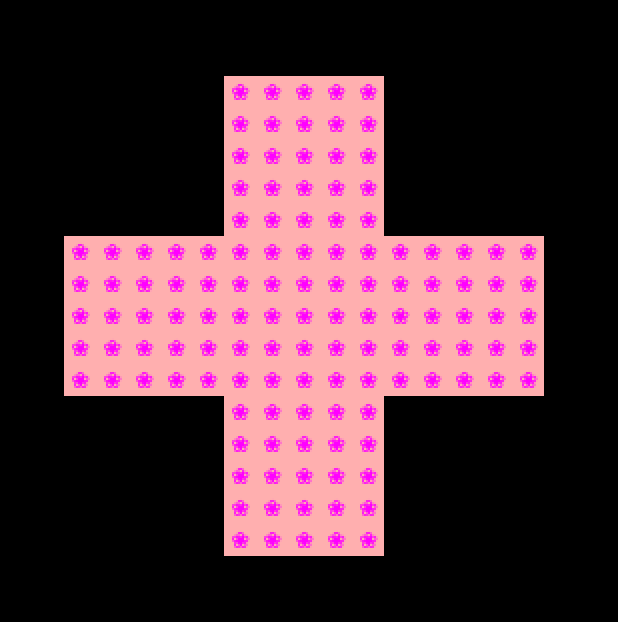
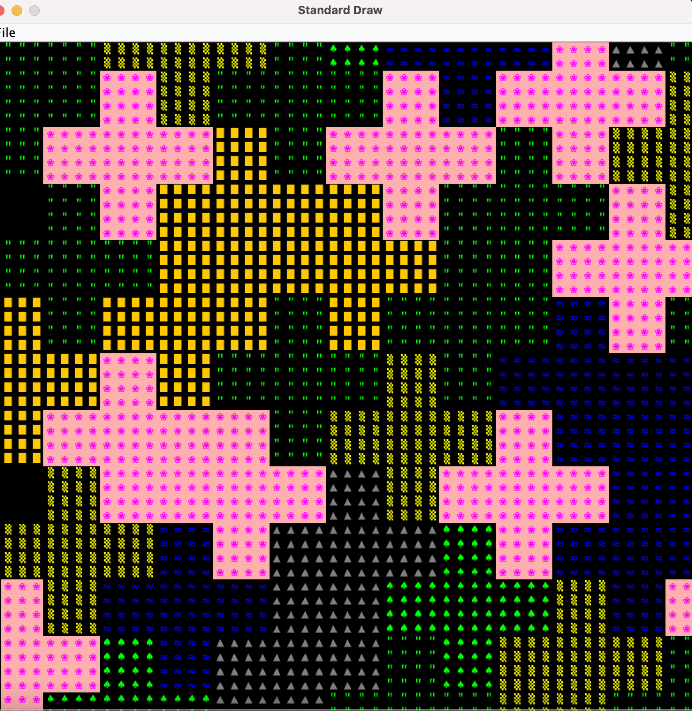
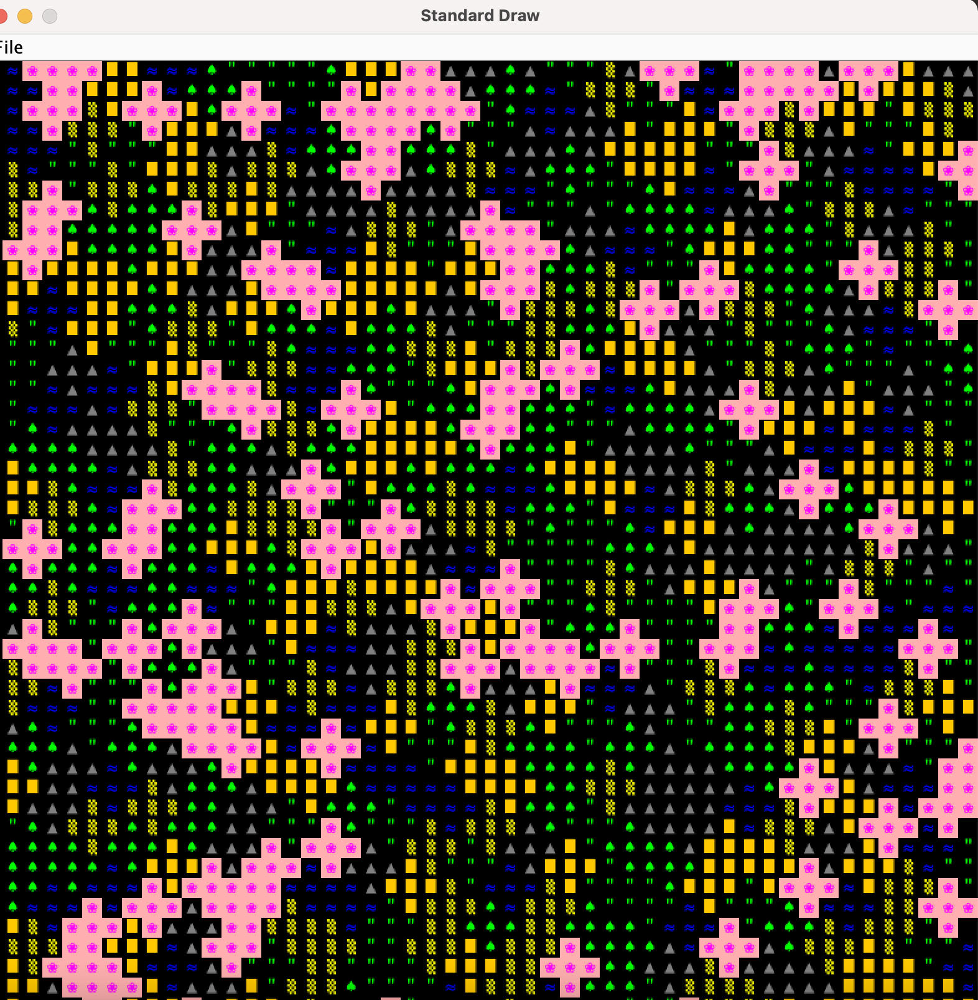
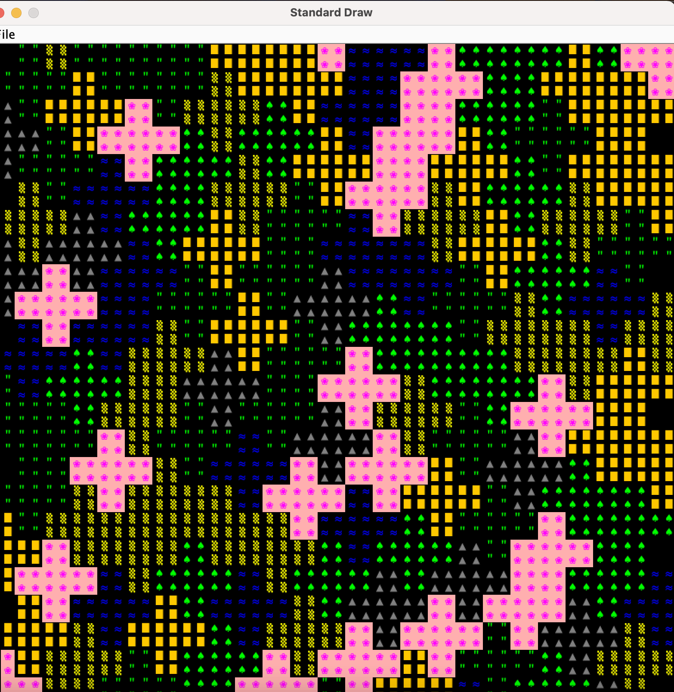
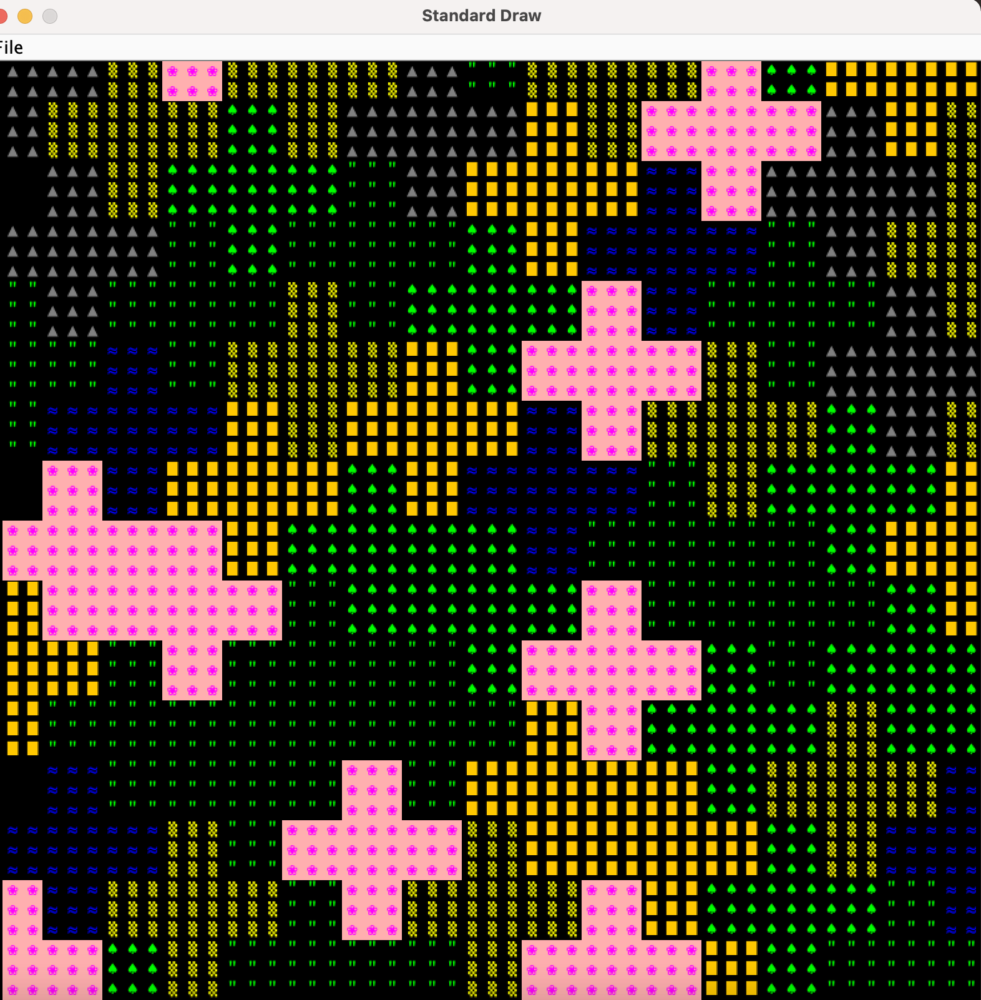
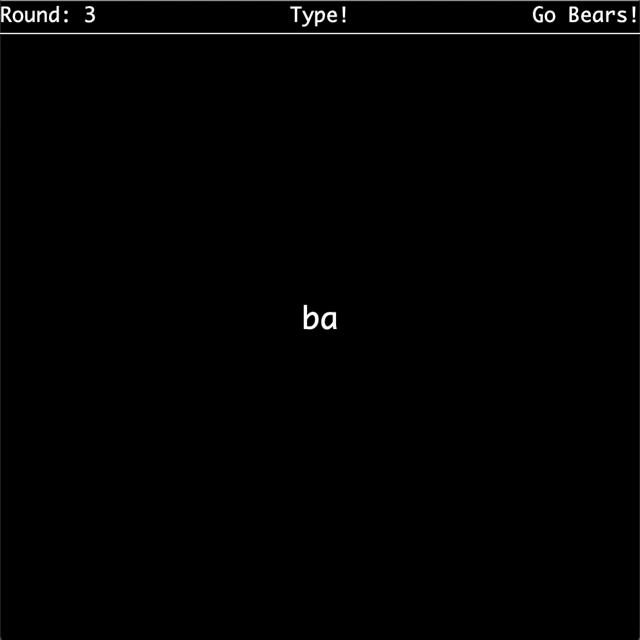

## [FAQ](faq.md)

Each assignment will have an FAQ linked at the top. You can also access it by
adding "/faq" to the end of the URL. The FAQ for Lab 16 is located
[here](faq.md).

This lab is divided into two main parts– "Plus World" and "Memory Game". Both will help you with Project 3: Build your own World (BYOW).
The first part will teach you how to use a set of "tiles" to generate shapes on your screen. This will apply to building the rooms, hallways, and other features of your world in Project 3. The second part will teach you more about how to use the StdDraw package to make a fun text-based game. This will help you build the main menu and other text-based elements of Project 3. It will also teach you how to achieve user interactivity, which is vital to Project 3!

Pre-lab
-------------------------------

Some steps to complete before getting started on this lab:

- As usual, use `git pull skeleton main`

- Watch a previous semester's project 3 getting started video [at this link](https://youtu.be/zgdNWICEb_M). Note the name and API have changed slightly, but the bigger picture still applies.

- Understand that project 3 will be a marathon and not a sprint. Don't wait until the last minute. You and your partner should start thinking about your design NOW.

Your lab today will be graded by completing a checkoff with a TA or AI during lab. This means you should try to finish the required parts of the lab ASAP, to avoid a long line to get checked off. This lab is due **24 hours from the start of your lab section with a 2 hour grace period,** instead of the usual 22 hours. This will allow you to get checked off the next day if necessary. 

Plus World Introduction
--------------------------------

In the first half of this lab, you and your partner will learn some basic techniques and tools that will be helpful for project 3.

Part I: Meet the Tile Rendering Engine
--------------------------------

#### Boring World

Open the up the skeleton and check out the `BoringWorldDemo` file in `PlusWorld`. Try running it and you should see a window appear that looks like the following:


This world consists of empty space, except for the rectangular block near the bottom middle. The code to generate this world consists of three main parts:
 - Initializing the tile rendering engine.
 - Generating a two dimensional `TETile[][]` array.
 - Using the tile rendering engine to display the `TETile[][]` array.

The API for the tile rendering engine is simple. After creating a `TERenderer` object, you simply need to call the `initialize` method, specifying the width and height of your world, where the width and height are given in terms of the number of tiles. Each tile is 16 pixels by 16 pixels, so for example, if we called `ter.initialize(10, 20)`, we'd end up with a world that is 10 tiles wide and 20 tiles tall, or equivalently 160 pixels wide and 320 pixels tall. For this lab, you don't need to think about pixels, though you'll eventually need to when you start building the user interface for Project 3.

`TETile` objects are also quite simple. You can either build them from scratch using the `TETile` constructor (see `TETile.java`), or you can choose from a palette of pregenerated tiles in the file `Tileset.java`. For example, the code from `BoringWorldDemo.java` below generates a 2D array of tiles and fills them with the pregenerated tile given by `Tileset.NOTHING`.

```java
TETile[][] world = new TETile[WIDTH][HEIGHT];
for (int x = 0; x < WIDTH; x += 1) {
    for (int y = 0; y < HEIGHT; y += 1) {
        world[x][y] = Tileset.NOTHING;
    }
}
```

Of course, we can overwrite existing tiles. For example, the code below from `BoringWorld.java` creates a 14 x 4 tile region made up of the pregenerated tile `Tileset.WALL` and writes it over some of the `NOTHING` tiles created by the loop code shown immediately above.

```java
for (int x = 20; x < 35; x += 1) {
    for (int y = 5; y < 10; y += 1) {
        world[x][y] = Tileset.WALL;
    }
}
```


The last step in rendering is to simply call `ter.renderFrame(world)`, where `ter` is a `TERenderer` object. Changes made to the tiles array will not appear on the screen until you call the `renderFrame` method.

Try changing the tile specified to something else in the `Tileset` class other than `WALL` and see what happens. Also experiment with changing the constants in the loop and see how the world changes.






#### Random World

Now open up `RandomWorldDemo.java`. Try running it and you should see something like this:


This world is sheer chaos -- walls and flowers everywhere! If you look at the `RandomWorldDemo.java` file, you'll
see that we're doing a few new things:
 - We create and use an object of type `Random` that is a "[pseudorandom number generator](https://en.wikipedia.org/wiki/Pseudorandom_number_generator)".
 - We use a new type of conditional called a switch statement.
 - We have delegated work to functions instead of doing everything in main.

A random number generator does exactly what its name suggests, it produces an infinite stream of numbers that appear to be randomly ordered. The `Random` class provides the ability to produce *pseudorandom* numbers for us in Java.  For example, the following code generates and prints 3 random integers:

```java
Random r = new Random(1000);
System.out.println(r.nextInt());
System.out.println(r.nextInt());
System.out.println(r.nextInt());
```

We call `Random` a *pseudorandom* number generator because it isn't truly random. Underneath the hood, it uses cool math to take the previously generated number and calculate the next number. We won't go into the details of this math, but see [Wikipedia](https://en.wikipedia.org/wiki/Pseudorandom_number_generator) if you're curious. Importantly, the sequence generated is deterministic, and the way we get different sequences is by choosing what is called a "seed". If you start up a pseudorandom generator with a particular seed, you are guaranteed to get the exact sequence of random values.

In the above code snippet, the seed is the input to the `Random` constructor, so 1000 in this case. Having control over the seed is pretty useful since it allows us to indirectly control the output of the random number generator. If we provide the same seed to the constructor, we will get the same sequence values. For example, the code below prints 4 random numbers, then prints the SAME 4 random numbers again. Since the seed is different than the previous code snippet, the 4 numbers will likely be different than the 3 numbers printed above. This is super helpful in Project 3, as it will give us deterministic randomness: you worlds look totally random, but you can recreate them consistently for debugging (and grading) purposes.

```java
Random r = new Random(82731);
System.out.println(r.nextInt());
System.out.println(r.nextInt());
System.out.println(r.nextInt());
System.out.println(r.nextInt());
r = new Random(82731);
System.out.println(r.nextInt());
System.out.println(r.nextInt());
System.out.println(r.nextInt());
System.out.println(r.nextInt());
```

In the case a seed is not provided by the user/programmer, i.e. `Random r = new Random()`, random number generators select a seed using some value that changes frequently and produces a lot of unique values, such as the current time and date. Seeds can be generated in all sorts of other stranger ways, such as [using a wall full of lava lamps](https://www.popularmechanics.com/technology/security/news/a28921/lava-lamp-security-cloudflare/).

For now, `RandomWorldDemo` uses a hard coded seed, namely 2873123, so it will always generate the exact same random world. You can change the seed if you want to see other random worlds, though given how chaotic the world is, it probably won't be very interesting.

The final and most important thing is that rather than doing everything in `main`, **our code delegates work to functions with clearly defined behavior**. This is critically important for your project 3 experience! You're
going to want to constantly identify small subtasks that can be solved with clearly defined methods. Furthermore, your methods should form a hierarchy of abstractions! We'll see how this can be useful in the final part of this lab.

Part II: Use the Tile Rendering Engine
--------------------------------

#### Plus World Intro

Above, we've seen how we can draw a world and generate randomness. Your task for the first half of lab is to use the tile generator we've seen to make a plus shape, like below.



 Optionally, you can take these plus shapes, and form a beautiful (and randomized) tesselation like below.



In the actual Project 3, you'll be generating random worlds as well, although in
the project, they will be indoor spaces instead of open landscapes. While this
lab task does not directly apply to the project, it will familiarize you with important
libraries including our Tile Rendering engine, and also help you think about how you can take
complex drawing tasks and break them into simpler pieces.

Your should be able to draw differently sized plus signs. The picture above is of size-4 plusses,
and below we see a world consisting of size-1, size-2, and size-3 plusses, respectively.







#### Drawing A Single Plus

The only task you are required to do for this section of the lab is to draw a single plus. Tesselating them to fill the whole screen is a cool but optional task. Your class is completely blank, but you're encouraged to reference `BoringWorld` and `RandomWorld` to get an idea of how to set up the class! Once you've done the setup to make an empty world, start by trying to create a method `addPlus` that adds a plus of size `s` to a given position in the world.

Here, we see the size is the tile width for one "leg" of the plus. There are many ways to break down a plus. You could think of it as three rows, where the middle row is wider. You could think of it as 5 squares: top, bottom, left, right, and center. You could view it as neither! The way you define the "position" of a plus is also up to you! For this lab, we won't care about where in the map your plus is, the TA will just check that you've made one at all.

```
                       aaa
           aa          aaa
           aa          aaa
  a      aaaaaa     aaaaaaaaa
 aaa     aaaaaa     aaaaaaaaa
  a        aa       aaaaaaaaa
           aa          aaa
                       aaa
                       aaa
```

To verify that your `addPlus` method works, write a short main method and verify that things looked OK.  Unfortunately, writing a `JUnit` test to verify that you've properly drawn a plus is just as hard as drawing the plus itself, so you won't be able to build confidence in your `addPlus` method in a nice way like you can with simpler methods.

Note that even deciding the `addPlus` method signature is a non-trivial task! This exercise will give you a glimpse into the kind of decision-making and design thinking you will have to do in Project 3.

Deciding what classes you need for this lab, just like Proj3, is entirely up to you! One example class you might add is a `Point` class, to represent coordinates in your world. You can also think about making a `Plus` class. This will require some careful thinking about what a `Plus` object is in this program, what it should know about itself (i.e. what are its instance variables), and what it can do (i.e. its public instance methods). This is what a lot of your work on Project 3 is going to look like! 

There are many different ways to approach this problem, and that's what makes it so interesting.


#### Extra: Drawing A Tesselation of Plusses

Once you have code that can draw a single plus, you can try to tessellate them to form a world, like shown in the example images earlier. Do NOT attempt this until finishing the Memory Game in the next part of the lab. You should prioritize finish drawing the single plus and memory game, as this is what your TA will check for. It is in your best interest to do the checkoff ASAP and avoid a long wait, as things tend to get more chaotic right before the deadline.

As with drawing a single plus, there are a huge number of ways to draw a tesselation. The most important part is to identify helper methods that will be useful for the task!

You should absolutely not try to do something like do everything in a nested for loop with no helper methods. While it is technically possible to do this, **you will melt your brain.** In this project, it is **absolutely vital** that you avoid the temptation to always work at a "low level". Without hierarchical abstraction, your **mind will transform into a pile of goo** under the weight of all the complexity.

By writing very well-defined, nicely commented helper methods, you also make it physically possible to get help from course staff. During office hours for this project, TAs will be limited to ten minutes per pair, and will not be allowed to spend a long time getting to know the intricacies of your code. They are there for high level guidance, as well as help debugging when you've really exhausted all your options.

As a hint for one possible solution, look for repeating patterns in a given tesselation. If you look at a single plus in a tesselation, when does it "repeat" itself? How many squares do you have to move over until you find another plus at that same height in the image?


Memory Game Introduction
--------------------------------
We can now move onto the second half of this lab! In preparation for making your game, we will use `StdDraw` and `java.util.Random` to construct a simple memory game. This game is much like the electronic toy [Simon](https://en.wikipedia.org/wiki/Simon_(game)), but on a computer and with a keyboard instead of with 4 colored buttons. The goal of the game will be to type in a randomly generated target string of characters after it is briefly displayed on the screen one letter at a time. The target string starts off as a single letter, but for each successful string entered, the game gets harder by making the target string longer.

Eventually we want `MemoryGame.java` to have a main method which will launch a playable memory game, but instead of jumping straight into the implementation of the game, it is good to try and break down what tasks you will need to perform in order to run a game. For this memory game it would looks something like:
1. Create the game window
2. Randomly generate a target string
3. Display target string on screen one character at a time
4. Wait for player input until they type in as many characters as there are in the target
5. Repeat from step 2 if player input matches the target string except with a longer random target string. If no match, print a game over message and exit.

In general, good coding practice is to first build small procedures with explicit purposes and then compose more complex methods using the basic ones. Eventually, you’ll be able to build up something as complicated as a game or text editor using just a few lines in your main method. If you take a look at `MemoryGame.java` you will see that we have written in a few method headers which will each handle one of the above tasks. This process of identifying the steps of your game and breaking it apart into individual methods is highly recommended for project 3. It will give you a clear path forward in development and also provide clear breaks for unit tests.

By the end of the lab, you'll have something that functions like the below GIF:



## Providing arguments to `main`
The main method will request that the user provides a command line argument: a seed for the random String generation. To provide a command line argument to the `main` method while running your program in Intellij, use Run > Edit Configurations > Program Arguments. You can then type in a number in that box to be passed to your program and used as your seed.

## `drawFrame`

We've provided you with one very helpful method: drawFrame. It uses the `StdDraw` library from Princeton, which you will have to get comfortable with for Project 3. In PlusWorld, our tile engine was actually secretly using `StdDraw` under the hood to draw up all the tiles! Now, we will use `StdDraw` directly. We use the `StdDraw` library because it is rather light and easy to get started with, but there are a few quirks of the library you should be aware of while working with it. Notably, when we want to change what is displayed on the screen, we have to clear the entire screen and redraw everything we want to show up. Because of this, it is incredibly useful to have a method which first clears the canvas, draws everything necessary for the next frame, and then shows the canvas.

This is what `drawFrame` does for us. We know we need to display strings on the screen and they should be noticeable. It clears the canvas, sets the font to be large and bold, draws the input string so that it is centered on the canvas, and then shows the canvas on the screen. It also displays some other information like the round number, and whether the player should currently be typing in an answer or watching for the next round. In your `startGame()` method you'll write in more of the logic to make this actually work. Try running the `main` method of MemoryGame right now, and you'll see what this all looks like so far.

**Discuss with a partner how the methods you see here can apply to your BYOW project. What does each line do? Do you think you could use these yourself?**

This would be a good time to look at the [StdDraw](https://introcs.cs.princeton.edu/java/stdlib/javadoc/StdDraw.html) API and figure out exactly how it works. Some useful methods to look at include:

- [`StdDraw.setFont`](https://introcs.cs.princeton.edu/java/stdlib/javadoc/StdDraw.html#setFont(java.awt.Font))
- [`StdDraw.clear`](https://introcs.cs.princeton.edu/java/stdlib/javadoc/StdDraw.html#clear())
- [`StdDraw.text`](https://introcs.cs.princeton.edu/java/stdlib/javadoc/StdDraw.html#text(double,%20double,%20java.lang.String))
- [`StdDraw.setPenColor`](https://introcs.cs.princeton.edu/java/stdlib/javadoc/StdDraw.html#setPenColor(java.awt.Color))
- [`StdDraw.show`](https://introcs.cs.princeton.edu/java/stdlib/javadoc/StdDraw.html#show())

## `generateRandomString`

First task: we need to be able to randomly generate a string of a specified length. Briefly mentioned above, this random generation should be done using `java.util.Random`.

Look at the `MemoryGame` constructor, and see how it creates a `Random` object which uses the first program argument as the seed. After that, complete `generateRandomString` so that it produces a random string using your `Random` object that is the length specified by the input `n`. Since we only want to produce strings of lowercase characters, the private `CHARACTERS` field has been provided for your convenience.

You can choose to either use the methods of `java.util.Random` or use our helpful utility methods in `byow.Core.RandomUtils`. All of the utility methods take in a `Random` object as a parameter, so they do all use the relevant `java.util.Random` method under the hood: you can take a look if you're curious how these utilities work!

You might find yourself having issues with working with variables of type `char` and `String`. Here are three useful things you should know about them:

1. In Java, a `Character` or `char` is wrapped with single quotes `'B'` whereas `String` objects are wrapped with double quotes `"and can be longer"`.

2. You can add a `char` to a `String` with the `+` operator:

```java
String favClass = "CS 61" + 'B';
```

3. You can convert a `char` to a `String` via:
```java
String B = Character.toString('B');
```

## `flashSequence`

Using what we’ve built so far and the provided `drawFrame`, we need to define a procedure which presents the target string one character at a time. Write `flashSequence` so that it takes the input string and displays one character at a time centered on the screen. Each character should be visible on the screen for 1 second and there should be a brief 0.5 second break between characters where the screen is blank.

## `solicitNCharsInput`

After displaying the target string one character at a time, we need to wait for the player to type in their string. For this task, we will have to use `StdDraw`’s key listening API to read in what the player typed. The methods of interest in this lab are `hasNextKeyTyped` and `nextKeyTyped`. They interact with a queue `StdDraw` uses to store all the keys the user has pressed and released. `hasNextKeyTyped` looks to see if there is any keystroke left in the queue while `nextKeyTyped` removes the key at the front of the queue and returns it. Note that `nextKeyTyped` returns the key as a `char` - this is another quirk of `StdDraw` and prevents us from using any keys on the keyboard which do not correspond to a `char` value.

Once you’ve familiarized yourself with how `StdDraw` handles inputs from the keyboard, write `solicitNCharsInput` which reads `n` keystrokes using `StdDraw` and returns the string corresponding to those keystrokes. Also, the string built up so far should appear centered on the screen as keys are being typed by the user so that they can see what they’ve hit so far.

## `startGame`

We’re almost there! Now that we have defined all of our subprocesses, it is time to put them together and run our game. The `startGame` method should launch our game and begin the loop of gameplay until the player fails to type in the target string. The code for `startGame` should look like a translation of the following process into code:

1. Start the game at round 1
2. Display the message “Round: “ followed by the round number in the center of the screen
3. Generate a random string of length equal to the current round number
4. Display the random string one letter at a time
5. Wait for the player to type in a string the same length as the target string
6. Check to see if the player got it correct
  - If they got it correct, repeat from step 2 after increasing the round by 1
  - If they got it wrong, end the game and display the message “Game Over! You made it to round:” followed by the round number they failed in the center of the screen

After you’ve done this you should be able to run `MemoryGame.java` and play your game! It’s somewhat bare bones and definitely not pretty, but you can play with the StdDraw methods and see how they change the appearance. Graphic design is our passion...

## Submission

To get credit for this lab, you'll have to do a checkoff during lab, with either your TA or an AI. You will be asked to show that you can generate a single plus at various sizings (or a whole tesselaton), and that you can play your memory game. Once you complete your checkoff, your TA/AI should give you a magic word, which you can type it into magicword.txt. You will be solely graded off if your magic word is present. This is remniscent of how you will be graded for BYOW: though part of the project will be autograded, your final product will be graded in a checkoff with a staff member so you can show off your creative finished project!

If you want to get checked off outside of lab hours you can make a private Ed **Question** thread under Labs - Lab16 - Checkoff and make sure you follow the instructions on the template. 

